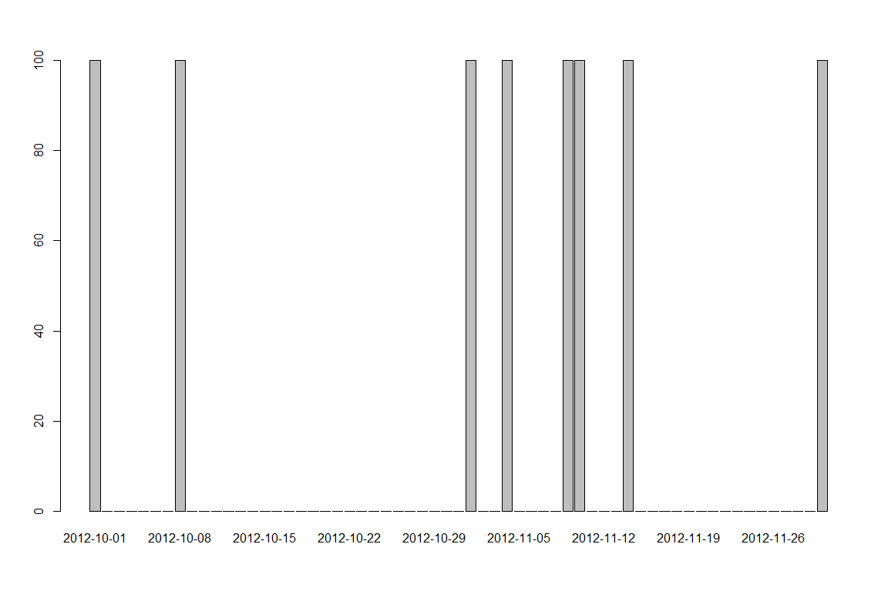
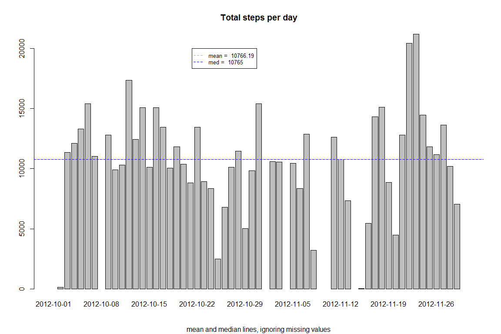
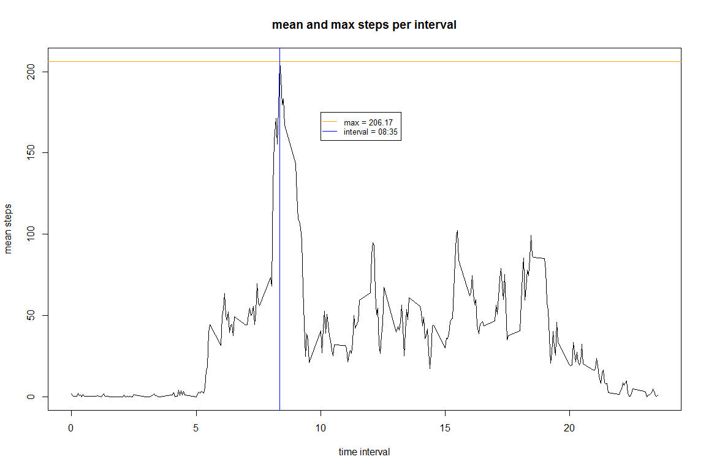
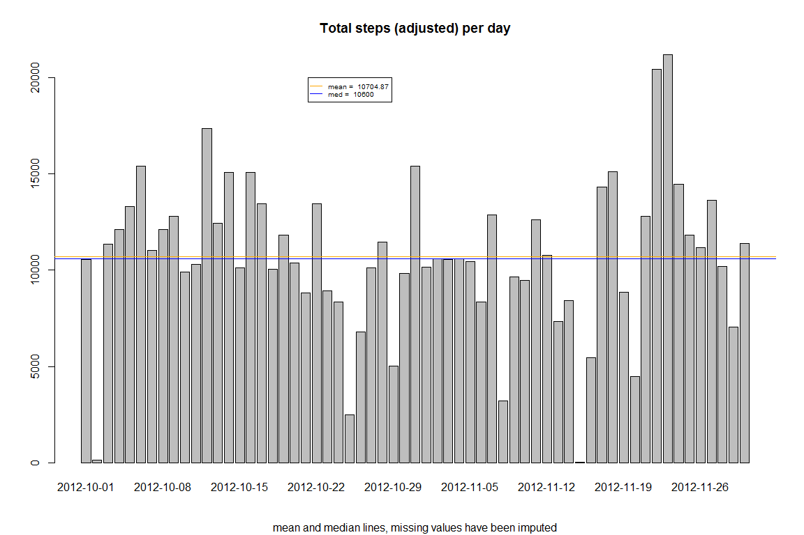
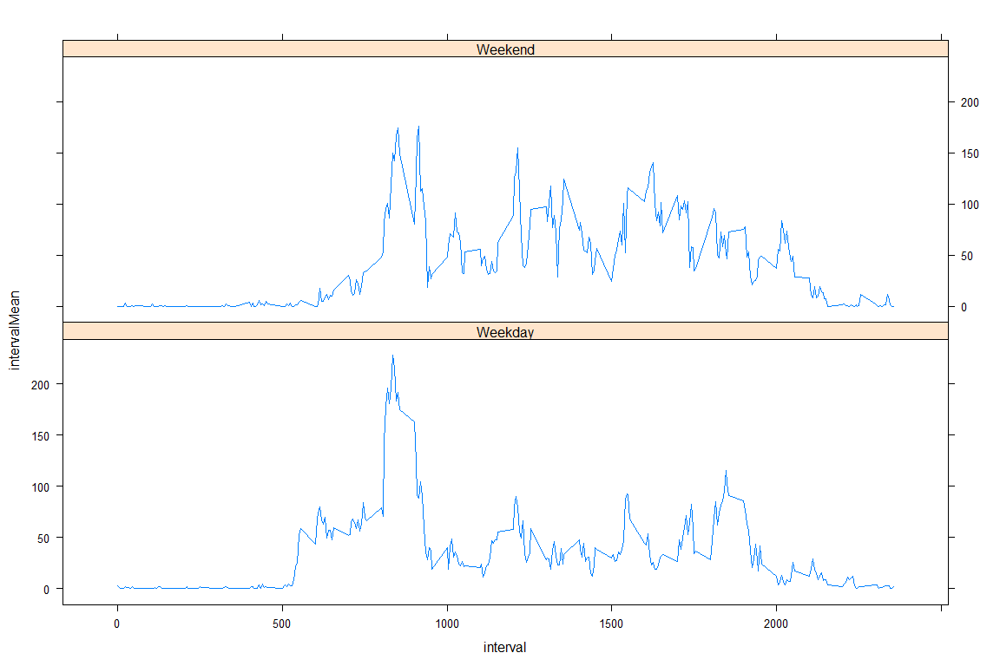

# Reproducible Research: Peer Assessment 1


## Loading and preprocessing the data

Here are the packages we'll use for this report. In order to reproduce the process, please ensure you have these installed already.


```r
library(lubridate)
library(dplyr)
library(tidyr)
library(lattice)
```

Here is the code to read in the data, assuming the zip file is in the working directory:


```r
unzip("activity.zip")
activity <- read.csv("activity.csv")
```

#### Basic sanity checks of the data

Review the summary, to sanity check the data load and also to determine the presence of NA values in the data:


```r
summary(activity)
```

```
##      steps                date          interval     
##  Min.   :  0.00   2012-10-01:  288   Min.   :   0.0  
##  1st Qu.:  0.00   2012-10-02:  288   1st Qu.: 588.8  
##  Median :  0.00   2012-10-03:  288   Median :1177.5  
##  Mean   : 37.38   2012-10-04:  288   Mean   :1177.5  
##  3rd Qu.: 12.00   2012-10-05:  288   3rd Qu.:1766.2  
##  Max.   :806.00   2012-10-06:  288   Max.   :2355.0  
##  NA's   :2304     (Other)   :15840
```

There are 17568 observations as expected from the assignment [rubric][1]. 

The data is heavily skewed towards the value 0 (zero): min, 1st Q and med are all 0.

We can also immediately see the presence of 2304 NA values. 

#### Exploratory Data Analysis

Further sanity checks of the data were done but not included here for brevity; How many days are included, and is there one measure per interval per day? Everything checked out OK with the data overall structure and date interval vectors.

I also did an exploratory plot to see if the subject followed conventional daily patterns i.e. sleeps at night, gets up at a sensible hour, active in the day, less active in the evening. I don't include it here for brevity, but everything was as expected.

What proportion (per cent) of all the values are the NA values?


```r
# building it as a simple function which I can re-use later
PropNA <- function(x) {
# find the proportion of NA values in a vector and return a percentage
    mean(is.na(x)) * 100
}

PropNA(activity$steps)
```

```
## [1] 13.11475
```

This may be significant.

The first question asks us to state the mean total number of steps taken per day. In order to determine if I can do this quickly, I run the following code:


```r
meanStepsPerDay <- with(activity, tapply(steps, date, mean, na.rm = TRUE))
head(meanStepsPerDay)
```

```
## 2012-10-01 2012-10-02 2012-10-03 2012-10-04 2012-10-05 2012-10-06 
##        NaN    0.43750   39.41667   42.06944   46.15972   53.54167
```

I can already see a problem in that the first value in my result is NaN, even though I used na.rm = TRUE when determining the mean. Why is that? A closer look at the data reveals that ALL the observations for the first day are NA!

Are there any more days like this, as it could really affect the investigation?


```r
NAperDay <- with(activity, tapply(steps, date, PropNA))
length(NAperDay[NAperDay!=0])
```

```
## [1] 8
```

```r
barplot(NAperDay)         
```

 

This has been crucial to understanding some underlying issues with the data. When NA values occur, they affect an entire day. Otherwise the day's data collection is always complete.

#### Preprocessing the data

Adding a factor variable to allow "hh:mm" display of the five minute interval, assuming 0 is midnight and 735 is "07:35"


```r
# I want a function that converts the 5 minute interval into format "hh:mm" for display purposes only

# takes in int which is supposed to represent time 
# ensure there is a leading "0" where necessary
# add the separateing colon
# e.g. 435 becomes "04:35" 
# while 2250 is simply returned as "22:50"

convertHM <- function(x) {
  if (is.na(x)) return(x)
  else {

    minsPart <- x %% 100
    hrPart <- (x - minsPart)/100
    
    leadingZero <- function(z) {
      if (z < 10) {
        paste0("0", z)
      } else as.character(z)
    }
    
    mn <- leadingZero(minsPart)
    
    hr <- leadingZero(hrPart)
    
    return(paste0(hr, ":", mn))
  }
}

# add it as a factor to my data frame
activity$hourMin <- sapply(activity$interval, convertHM)
```


## What is mean total number of steps taken per day?

With an understanding of the data described above, I now feel confident to take the mean of total steps per day, excluding the NA data with the following code:


```r
totalStepsPerDay <- with(activity, tapply(steps, date, sum))
meantspd <- mean(totalStepsPerDay, na.rm=TRUE)
medtspd <- median(totalStepsPerDay, na.rm=TRUE)
# For displaying the results nicely in the document
list("mean" = (round(meantspd,2)), "median" = medtspd)
```

```
## $mean
## [1] 10766.19
## 
## $median
## [1] 10765
```

As requested, presented here is a histogram (bar plot) of the total number of steps taken each day:


```r
barplot(totalStepsPerDay, main = "Total steps per day", sub = "mean and median lines, ignoring missing values")
abline(h=meantspd, col = "orange", lwd = 0.2)
abline(h=medtspd, col = "blue", lwd = 0.2, lty=2)
legend(x = 25, y = 20000, legend = c(paste ("mean = ", round(meantspd,2)), paste("med = ", medtspd)), cex = 0.8, pch = NA, lty = 2, col = c("orange", "blue"))
```

 

## What is the average daily activity pattern?

I now present the requested time series (line plot) of the total number of steps taken each day:


```r
# first create the mean steps per interval
meanspi <- with(activity, tapply(steps, hourMin, mean, na.rm = TRUE))
maxspi <- meanspi[which.max(meanspi)]
# For displaying the results nicely in the document
list("max" = maxspi)
```

```
## $max
##    08:35 
## 206.1698
```


```r
plot(unique(activity$interval)/100, meanspi, type = "l"
     , xlab = "time interval" , ylab = "mean steps", main = "mean and max steps per interval")
abline(h=maxspi, col = "orange", lwd = 0.2)
abline(v=activity$interval[which.max(meanspi)]/100, col = "blue", lwd = 0.2)
legend(x = 10, y = 175, legend = c(paste("max =", round(maxspi, 2)), paste("interval =", names(which.max(meanspi)))), cex = 0.8, pch = NA, lty = 1, col = c("orange", "blue"))
```

 

## Imputing missing values

We know the total number of steps per day from the summary is 2304. We can also compute it as follows:


```r
sum(is.na(activity$steps))
```

```
## [1] 2304
```

To impute the missing values I will implement a mean nearest neighbours strategy based on the matching the interval on the nearest days. To do this, I will make a matrix with days on columns and intervals on rows.


```r
imputingMatrix <- matrix(activity$steps, nrow = length(unique(activity$interval)))
dim(imputingMatrix)
```

```
## [1] 288  61
```

This object has the expected number of rows and columns (288 5 minute intervals over 61 days).

I know that the NA values are all or nothing in a day from earlier analysis so I only check the first row of imputingMatrix to get the columns I need to to work on.


```r
missingDays <- which(is.na(imputingMatrix[1,]))
missingDays
```

```
## [1]  1  8 32 35 40 41 45 61
```


Now I want to create a function that replaces any NA values with average values from the same time interval in a small number of neighbouring days, say 6. 

I need to deal gracefully with values at the extreme limits of any vector because I know from looking at the data that the first and last members are NA. 

My nearest neighbours function will handle this by taking more neighbours to the left or right as required to meet the number requested. 

Any additional NA values found in its own range will be replaced by randomly selected existing values from within its own range.

A more sophistacated approach might consider that different days have different characteristics (weekdays vs weekends) and select neighbours along this dimension. I may try this in a different life.

*note, this code block is relatively long but only contains the function to find the nearest neighbours of a value in a vector. The actual processing comes a bit later*


```r
# function includes some random sampling. I provide a set.seed in order to make the process reproducible
set.seed(123)


KNN <- function(posn, numNeighbs = 6, v, excludeSelf = TRUE) {
  # Function to determine the correct range of k nearest neighbours - replaces NA values by repeating randomly selected members from the within the nearest neighbour range
  
  # Basic sense check. position can't be outside the vector being analysed
  if (posn < 1) posn <- 1
  if (posn > length(v)) posn <- length(v) 
  
  # An inner function that gets the correct range for any position
  # dealing gracefully with the lower limit i.e. what if the range tail would be < 1
  find_knn <- function(x, k = 6, excludeSelf = TRUE) {
    k <- if (k < 1) 6 else k
    # determine the head and tail nearest neighbours
    K <- floor(k/2)
    i <- if (x - K < 1 ) 1 else x - K
    j <- if (i == 1) k + 1 else x + K
    nn <- i:j
    # if required to return the self element
    if (excludeSelf == FALSE) return(nn)
    else {
      # determine the index of the self element and remove it from the range of nn
      self <- if (x <= K) x else K + 1
      return(nn[-self])
    }
  }
  
  # Determine if the given position is at the upper limit of the vector being analysed
  # If so, I need to reverse the vector and position to work on
  # then return the results unreversed
  overrun <- posn + floor(numNeighbs/2) - length(v)
  if (overrun > 0) {
    nn <- rev(1 + length(v) - find_knn(k = numNeighbs, x = 1 + length(v) - posn, excludeSelf))
  } else {
    nn <- find_knn(k = numNeighbs, x = posn, excludeSelf)
  }
  
  # now I have the range of indexes to return
  # I need to deal with NA values by copying randomly chosen non NA values for each missing
  missing <- which(is.na(v[nn]))
  if (length(missing) > 0) {
    replace <- sample(nn[-(missing)],length(missing))
    nn <- c(nn[-missing], replace)
  }
  
  # Finally return the original vector elements requested
  v[nn]
}
```

Now I will use my function on the imputing matrix object to replace the missing values. 


```r
# My function can handle one position (missing value) from one vector (intervals over all days)
# Use sapply to find all the missing values for one interval vector at once.
# The result of the sapply is a matrix that holds nearest neighbour values for each missing day on the columns.
# Use colMeans on this resulting matrix to return a vector of replacement values for each missing day in the single interval.
# Use a loop to iterate through all the rows (intervals) of the imputing matrix to replace all the missing values.

for (i in 1:dim(imputingMatrix)[1]) {
imputingMatrix[i, missingDays] <-  round(colMeans(sapply(missingDays, KNN, v = imputingMatrix[i,])),0)
}
```

To create a new dataset that is equal to the original dataset but with the missing data filled in:


```r
# straighten out the matrix into one tall column, 
# i.e a vector in order and length the same as the original
dim(imputingMatrix) <- c(length(activity$steps), 1)

activityAdj <- select(activity, -steps) %>% 
                mutate(steps = as.numeric(imputingMatrix))
```

I am now ready to calculate the total, med and mean steps per day with the adjusted data:


```r
totalAdjStepsPerDay <- with(activityAdj, tapply(steps, date, sum))
meantaspd <- mean(totalAdjStepsPerDay, na.rm=TRUE)
medtaspd <- median(totalAdjStepsPerDay, na.rm=TRUE)
# For displaying the results nicely in the document
list("mean" = round(meantaspd,2), "median" = medtaspd)
```

```
## $mean
## [1] 10704.87
## 
## $median
## [1] 10600
```

The there has been a fraction of a % reduction in both the mean and the median, probably due to the high numbers of zeros in the base data. When the missing values are imputed from nearest neighbours, the likelihood of hitting a zero was very high. However, the effect is insignificant.

I also present as requested a histogram (bar plot) of the total number of steps taken each day:


```r
barplot(totalAdjStepsPerDay, main = "Total steps (adjusted) per day", sub = "mean and median lines, missing values have been imputed")
abline(h=meantaspd, col = "orange", lwd = 0.2)
abline(h=medtaspd, col = "blue", lwd = 0.2)
legend(x = 25, y = 20000, legend = c(paste ("mean = ", round(meantaspd,2)), paste("med = ", medtaspd)), cex = 0.6, pch = NA, lty = 1, col = c("orange", "blue"))
```

 

## Are there differences in activity patterns between weekdays and weekends?

First I need a function to take a day of the week and return weekday or weekend.


```r
weekpart <- function(dayOfWeek) {
  return(if (dayOfWeek == "Saturday" 
             | dayOfWeek == "Sunday")
            "Weekend" else "Weekday")
}
```

I use the above funtion to create separate means for each interval by weekdays and weekends and present the request time series (line) panel plot of the total number of steps taken each day, using the Lattice plotting system:


```r
# add a new factor variable of weekpart to the dataset
activityAdj$weekpart <- sapply(weekdays(ymd(activity$date)), weekpart)

# create the mean steps per interval per weekpart and shape the data for plotting
meansapi <- data.frame(with(activityAdj, tapply(steps, list(interval,weekpart), mean))) %>% 
  gather(weekpart, intervalMean) %>%
  mutate(interval = rep(unique(activity$interval), times = 2))

xyplot(intervalMean ~ interval | weekpart, data = meansapi, type = "l", layout = c(1,2))
```

 

We can see some differences such as:

* more activity at an earlier time on weekdays, perhaps getting up for work or college in the morning.
* less activity during the daytime on weekdays, perhaps sat at a desk much of the time
* more activity in the evenings on weekends, perhaps going out and socialising

References:  
[1]: https://github.com/julianhatwell/RepData_PeerAssessment1
